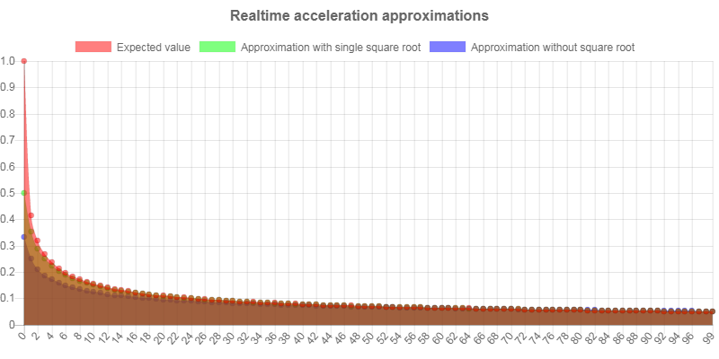
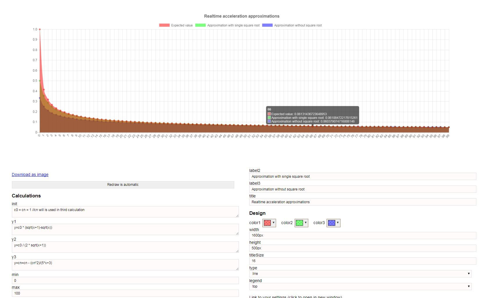

This is simple Javascript Grapher and Function plotter written for my own purposes. Released under MIT license, but be aware of licenses of other libraries used.

[Link to site](https://dalibor-drgon.github.io/grapher/)

Example - [Realtime acceleration approximations](https://dalibor-drgon.github.io/grapher/#init=c0%20%3D%20cn%20%3D%201%20%2F%2Fcn%20will%20is%20used%20in%20third%20calculation&y1=y%3Dc0%20*%20(sqrt(x%2B1)-sqrt(x))&y2=y%3Dc0%20%2F%20(2%20*%20sqrt(x%2B1))&y3=y%3Dcn%3Dcn%20-%20(cn*2)%2F(5*x%2B3)&min=0&max=100&step=1&label1=Expected%20value&label2=Approximation%20with%20single%20square%20root&label3=Approximation%20without%20square%20root&title=Realtime%20acceleration%20approximations&color1=rgba(255%2C0%2C0%2C0.5)&color2=rgba(0%2C255%2C0%2C0.5)&color3=rgba(0%2C0%2C255%2C0.5)&height=600px&titleSize=16&type=line&legend=top)

